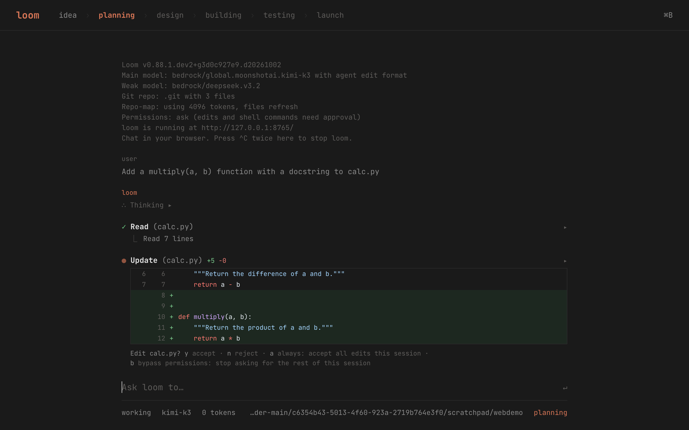

<h1 align="center">Loom</h1>

<p align="center">AI pair programming in your terminal.</p>

<p align="center">
Loom lets you pair program with LLMs to start a new project or build on your existing codebase, right from the command line.
</p>

---

## Features

- **In your browser too** — `loom --web` gives you the same loom in a Claude-Code-style web UI, with inline diffs you accept with `y`, project checkpoints, a file tree and an editor. See [the web UI](#web-ui).
- **Works as an agent** — ask for a change and the model finds the code, edits it, runs your tests and fixes what breaks, asking before each edit and command. See [the agent docs](loom/docs/agent.md).
- **Permissions you control** — approve each action, accept edits automatically, or plan read-only; allow trusted commands like `bash(pytest*)`.
- **Project memory** — put standing instructions in a `LOOM.md` file and they apply to every request.
- **Sessions** — `loom --continue` picks up your last conversation, and long tasks compact themselves instead of overflowing the context window. See [sessions](loom/docs/sessions.md).
- **MCP tools** — connect [MCP servers](loom/docs/mcp.md) and the agent can use their tools too.
- **Custom commands and hooks** — save prompts as [`/commands`](loom/docs/custom-commands.md) in `.loom/commands/`, and run [hooks](loom/docs/hooks.md) before or after the agent's tools to block commands, format files or report lint errors.
- **Cloud and local LLMs** — works best with Claude Sonnet, GPT-4o/o1/o3, and DeepSeek, but connects to almost any model, including local ones.
- **Maps your codebase** — builds a map of your whole repo so it works well in larger projects, not just single files.
- **100+ languages** — Python, JavaScript, Rust, Ruby, Go, C++, PHP, HTML, CSS, and dozens more via tree-sitter.
- **Git integration** — automatically commits each change with a sensible message; use normal git tools to diff, manage, and undo.
- **Use from your editor** — add comments to your code describing changes and Loom gets to work (`--watch`).
- **Images & web pages** — add screenshots, diagrams, and reference docs to the chat for visual context.
- **Voice-to-code** — describe features, tests, or fixes out loud and let Loom implement them.
- **Lint & test** — runs your linters and test suite after each change and fixes what breaks.

## Getting started

Loom isn't on PyPI — install it from this repo:

```bash
pip install git+https://github.com/sri-venkat-22/loom.git
```

Then point it at a model and your API key:

```bash
# Change into your codebase
cd /to/your/project

# Anthropic Claude Sonnet
loom --model sonnet --api-key anthropic=<key>

# OpenAI
loom --model gpt-4o --api-key openai=<key>

# DeepSeek
loom --model deepseek --api-key deepseek=<key>
```

Run `loom --help` to see all options. Configuration can also live in a `.loom.conf.yml` file or `LOOM_*` environment variables.

## Web UI



Run loom with `--web` to chat with it in your browser instead of the terminal:

```bash
cd /to/your/project
loom --web                    # serves http://127.0.0.1:8765/ and opens it
loom --web --port 9000        # another port
loom --web --no-browser       # open the address yourself
```

It's the same loom, with your models and settings: replies stream in as Markdown, tool calls show as cards, edits show as diffs you accept with `y` or reject with `n`, and Esc stops the current work. Your saved sessions are on the left (⌘\): click one to continue it. ⌘B opens the code changes since loom started on the right, along with your files, a Monaco viewer, `/run` output, the `/project` memory and the models. Type `/` or press ⌘K for commands. `/project` runs show their phases in the header and stop at inline checkpoints. Press ^C twice in the terminal to stop loom. The server only listens on 127.0.0.1.

See [the web UI docs](loom/docs/web.md) for the keys, commands and side pane.

## Development

```bash
git clone https://github.com/sri-venkat-22/loom.git
cd loom
python -m venv .venv && source .venv/bin/activate
pip install -e .
python -m pytest tests/basic
```

## License

Loom is licensed under the Apache-2.0 license. See [LICENSE.txt](LICENSE.txt).
